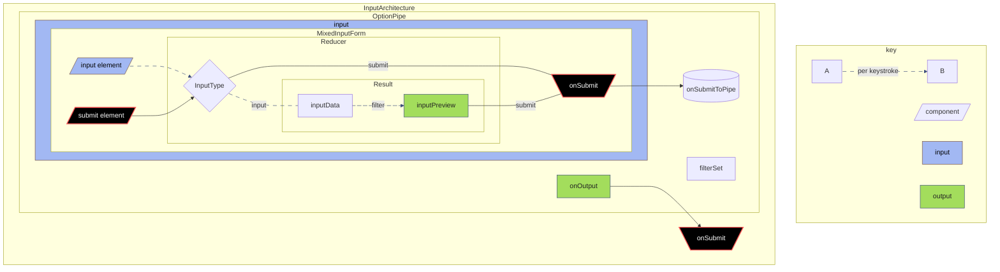

This is a [Next.js](https://nextjs.org) project bootstrapped with [`create-next-app`](https://github.com/vercel/next.js/tree/canary/packages/create-next-app).

## Getting Started

## Learn More

<details>
<summary>
To learn more about Next.js, take a look at the following resources:
</summary>
First, run the development server:

```bash
npm run dev
# or
yarn dev
# or
pnpm dev
# or
bun dev
```

Open [http://localhost:3000](http://localhost:3000) with your browser to see the result.

You can start editing the page by modifying `app/page.js`. The page auto-updates as you edit the file.
This project uses [`next/font`](https://nextjs.org/docs/app/building-your-application/optimizing/fonts) to automatically optimize and load [Geist](https://vercel.com/font), a new font family for Vercel.

- [Next.js Documentation](https://nextjs.org/docs) - learn about Next.js features and API.
- [Learn Next.js](https://nextjs.org/learn) - an interactive Next.js tutorial.

You can check out [the Next.js GitHub repository](https://github.com/vercel/next.js) - your feedback and contributions are welcome!

## Deploy on Vercel

The easiest way to deploy your Next.js app is to use the [Vercel Platform](https://vercel.com/new?utm_medium=default-template&filter=next.js&utm_source=create-next-app&utm_campaign=create-next-app-readme) from the creators of Next.js.

Check out our [Next.js deployment documentation](https://nextjs.org/docs/app/building-your-application/deploying) for more details.

</details>

# react-burning-ritual

> A burning ritual is a ceremony that involves releasing the past. It is often performed on holidays like New Year's Eve. The goal is to let go of negativity, suffering, or pain, and focus on the present.

> [!TIP]
> demo: <https://entitycs.github.io/react-burning-ritual/>

> [!IMPORTANT]
> [accessibility]
>
> If adding custom controller (input) elements, strive to enable all of the following, at minimum:
 >
 > - [x] mouse
 > - [x] touch
 > - [x] keyboard


*Testing mermaid flowchart TD (top-down) - currently fails silently, rendering as LR


# Features

## Pipe & Filter Architecture

Filters can use the state of the item in the pipe, and/or the state of a set of one or more controllers to control the mutators to be applied to the submitted value

## Grid

Just wanted something on the end of the pipe other than a div element.  Dragged elements retain dragged position in grid; grid contents + positions are reset upon changes to the grid size.

## Knob

A digital knob component, using a novel css trick, and no trig/pi values - can you identify the trick?

## GridSizeControl

Another custom input component; attempts to use advanced styling over 2 native html slider elements - not necessarily the most friendly control, but natively accessible.

## Controller Accessibility

All controls are touch, mouse, and keyboard accessible.
